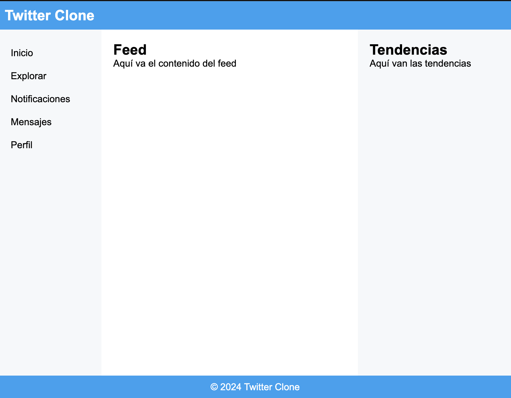

# Reproduce lo que se ve en la imagen. Es un clone muy basico del landing page de twitter.




## Investiga las etiquetas html y los estilos necesarios:
las propiedades css: 

## Utiliza el html:

```html
  <div class="container">
  <header>
    <nav>
      <h1>Twitter Clone</h1>
    </nav>
  </header>

  <div class="main-content">
    <aside class="sidebar">
      <ul>
        <li>Inicio</li>
        <li>Explorar</li>
        <li>Notificaciones</li>
        <li>Mensajes</li>
        <li>Perfil</li>
      </ul>
    </aside>

    <section class="content">
      <h2>Feed</h2>
      <p>Aquí va el contenido del feed</p>
    </section>

    <aside class="extra">
      <h2>Tendencias</h2>
      <p>Aquí van las tendencias</p>
    </aside>
  </div>

  <footer>
    <p>© 2024 Twitter Clone</p>
  </footer>
</div>
```

y el css

```css
  * {
  margin: 0;
  padding: 0;
  box-sizing: border-box;
}

body {
  font-family: Arial, sans-serif;
}

.container {
  display: flex;
  flex-direction: column;
  height: 100vh;
}

header {
  background-color: #1da1f2;
  color: white;
  padding: 10px;
  text-align: center;
}

header nav {
  display: flex;
  justify-content: space-between;
  align-items: center;
}

.main-content {
  display: flex;
  flex: 1;
}

.sidebar {
  width: 20%;
  background-color: #f5f8fa;
}

.sidebar ul {
  list-style: none;
}

.sidebar ul li {

}

.content {
  flex: 1;
  padding: 20px;
  background-color: #ffffff;
}

.extra {

}

footer {
  
}

.container-figures {
 
}

```
